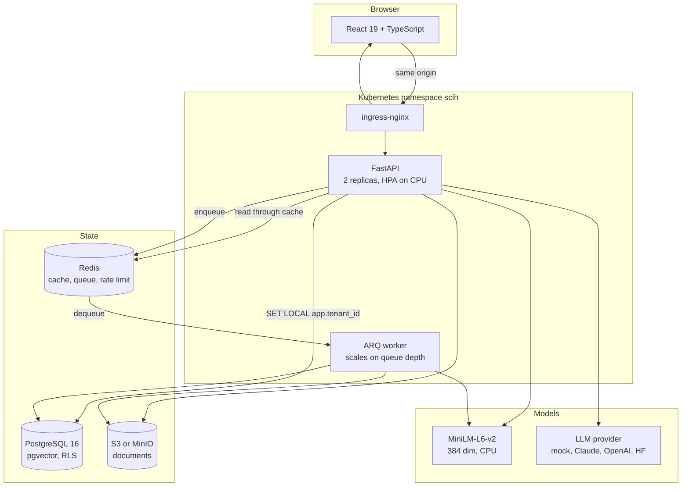
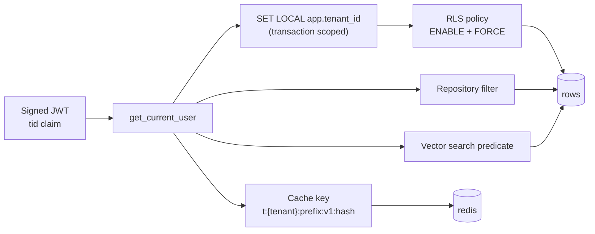

# Supply Chain Intelligence Hub

Multi-tenant platform that turns shipping manifests, invoices and supplier contracts into
queryable insights. Companies sign up as separate tenants, upload documents, and ask questions
in plain language against their own data.

```
Q: What is the penalty for late delivery?
A: The supplier pays 2 percent of the shipment value for each complete week of
   delay, capped at 10 percent. [1]
   [1] contract_acme_supply_2026.pdf, page 4, clause 4.2 Late Delivery
```

Everything below runs with `make up` and no API key.

## What this demonstrates

| Area | What is here |
|---|---|
| Fullstack | FastAPI and React 19, 41 REST endpoints, frontend types generated from the OpenAPI schema and checked in CI |
| AI engineering | Hybrid retrieval over pgvector and Postgres full text search fused with RRF, grounded citations, an intent router that sends structured questions down a SQL path instead |
| Multi-tenancy | Postgres row-level security, tenant-scoped repositories, namespaced cache keys, proven by tests that ask for the other tenant's data |
| DevOps | Kustomize manifests running on a real Kubernetes cluster, four CI workflows, Terraform for VPC, EKS, RDS, ElastiCache and S3 |
| Production concerns | JSON logs correlated across API and worker, Prometheus metrics with bounded label cardinality, liveness split from readiness, graceful shutdown |

## Quick start

Docker with at least 6 GB of memory.

```bash
git clone https://github.com/dylanpham1989/supply-chain-intelligence-hub.git
cd supply-chain-intelligence-hub
make up && make migrate && make seed
open http://localhost:5173      # acme-logistics / admin@acme.test / Demo1234!
```

`make smoke` drives the whole thing from the command line: upload a contract, wait for it to be
indexed, ask a question, require citations in the answer.

| Service | URL |
|---|---|
| Web | http://localhost:5173 |
| API docs | http://localhost:8000/docs |
| MinIO console | http://localhost:9001 |
| Postgres | localhost:55432 |
| Redis | localhost:56379 |

Postgres and Redis are published on 55432 and 56379 rather than their usual ports, because a
native instance on the machine takes the loopback address first and host tooling would then
talk to the wrong database.

The default LLM provider is a mock, which is why none of this needs a key. Set `LLM_PROVIDER`
and `LLM_API_KEY` for Claude, OpenAI or Hugging Face.

## Architecture



Sequence diagrams for ingestion, retrieval and the token lifecycle are in
[docs/architecture.md](docs/architecture.md).

## Tenant isolation

The claim this project makes most loudly, so it is the one with the most evidence behind it.



The tenant comes from a signature-verified claim and never from a body, a query parameter or a
header. `set_config('app.tenant_id', :id, true)` ties it to the transaction, so a pooled
connection cannot carry one tenant's id into the next request, and an unset value resolves to
NULL, which matches nothing: a request that forgets to scope itself reads zero rows rather than
everything. The application role is created `NOSUPERUSER NOBYPASSRLS`, so the policies cannot be
sidestepped.

The layers are not decorative. Row-level security does not reach Redis, so the cache key carries
the tenant itself. Mutation testing showed why both are needed: deleting the repository's tenant
predicate left all ten isolation tests passing, because the database caught it underneath. Two
tests were added that scope the session to one tenant and then ask the store for another's rows,
which is the only way to see the application layer on its own.

## Measured results

Measured on an Apple Silicon laptop with everything in Docker, against the seeded demo data of
320 shipments and 81 document chunks. Commands are in [docs/performance.md](docs/performance.md).

| Metric | Value | How measured |
|---|---|---|
| Shipment list p95 | 3.8 ms | `scripts/bench.py`, 60 sequential requests |
| Analytics summary p95, cached | 2.4 ms | same |
| Analytics summary, cache miss | 3.4 ms | `FLUSHDB` then one request |
| RLS policy evaluation | once per statement, not per row | `EXPLAIN ANALYZE` shows a `One-Time Filter` |
| Document ingestion, 6 page PDF | 320 ms to 11 chunks | worker log, `ingest.completed` |
| Embedding those chunks | 211 ms | worker log, `embed.completed` |
| Backend tests | 315 in 64 s | `make test`, real Postgres, Redis and MinIO |
| Backend coverage | 92.5 percent overall, 90 percent floor on security critical modules | `make test-cov` |
| `/metrics` scrape | 4.7 ms | `curl -w` against the running api |
| Initial JS bundle | 92 kB gzipped, charts in a separate 117 kB chunk | `npm run build` |
| Images | api 2.21 GB, worker 2.38 GB, web 77 MB | `docker images` |

The cache saves nothing measurable at 320 rows, and the table says so. It is built for the data
size this demo does not have.

## Key decisions

Eleven records in [docs/adr](docs/adr/README.md), each with the alternatives and a **Revisit
when** condition. The ones most worth reading:

| Decision | Why it is interesting |
|---|---|
| [Shared schema with RLS](docs/adr/002-shared-schema-rls.md) | Where isolation lives, and what it costs |
| [Refresh rotation with reuse detection](docs/adr/003-jwt-refresh-rotation.md) | What happens when a token is stolen |
| [The model emits filters, never SQL](docs/adr/007-llm-emits-filters-not-sql.md) | How an injection surface was removed rather than mitigated |
| [pgvector rather than a vector database](docs/adr/006-pgvector-default.md) | When that stops being right |
| [kind rather than a real EKS cluster](docs/adr/010-kubernetes-local-vs-cloud.md) | The cost table behind the choice |

## Testing

315 backend tests, 168 unit and 147 integration, plus 30 frontend tests. Integration runs
against the same Postgres the application uses, in a transaction that is rolled back; there is no
SQLite mode, because row-level security, pgvector and the generated full text column are the
things worth testing and SQLite has none of them.

Coverage is 92.5 percent, and `scripts/check_critical_coverage.py` holds six modules that decide
who sees whose data to a separate 90 percent floor. It failed on its first run and the gap was
real: a delete path with no test and a helper with no caller.

Several guarantees were mutation tested, and one round of that found the isolation tests were
nearly worthless. Details in [docs/testing.md](docs/testing.md).

## Deployment

| | Command | State |
|---|---|---|
| Compose | `make up` | runs |
| Kubernetes | `make kind-up && make kind-deploy` | runs, on a real cluster |
| AWS | `infra/terraform` | validated and scanned in CI, never applied |

The Kubernetes manifests carry the decisions worth explaining: three probes with different
jobs, a migration Job rather than an init container so two replicas cannot race through alembic,
`preStop` covering the gap between SIGTERM and endpoint removal, a worker grace period longer
than its job timeout, and an HPA on CPU for the api next to a KEDA object on queue depth for the
worker, because a worker that waits on I/O never shows the CPU that would scale it.

Terraform is not applied because an idle EKS cluster with RDS and a NAT gateway costs about 290
dollars a month. The full breakdown and what that trade gives up is in
[docs/deployment.md](docs/deployment.md).

## Known limitations

- **No OCR.** A scanned PDF with no text layer is rejected with a clear error rather than
  silently indexed as empty. Textract or Tesseract in the worker is the next step.
- **Terraform is validated, not applied.** IRSA, the bucket policy, the security groups and
  ExternalSecret syncing have never been exercised against AWS. See
  [ADR 010](docs/adr/010-kubernetes-local-vs-cloud.md).
- **NetworkPolicies are applied but not enforced** on the local cluster, whose default CNI
  ignores them. Enforcement needs Calico or Cilium.
- **Offset pagination.** Fine here, wrong past roughly 100,000 rows per tenant, where `OFFSET`
  and `COUNT(*)` both become the slowest part of the request. See
  [ADR 005](docs/adr/005-offset-pagination.md).
- **Prompt injection is mitigated, not solved.** Document text is untrusted input, the model
  never emits SQL and answers render as text, but a contract that argues with its own clause can
  still steer an answer. The blast radius is a wrong answer with a citation that does not support
  it. See [docs/security.md](docs/security.md).
- **No risk classifier.** It was in the plan and was dropped rather than trained on generated
  labels, which would have produced a number nobody could defend. See
  [ADR 009](docs/adr/009-no-risk-classifier.md).
- **HNSW recall degrades with a selective tenant filter**, because the filter is applied after
  the graph walk. Partitioning by `tenant_id` is the path past a few hundred tenants.
- **No load testing.** Every latency number here is sequential and single client. There are no
  capacity numbers and none are claimed.
- **No audit log and no data deletion path.** A tenant cannot ask for their data to be removed,
  which a real product would need before a real customer signed anything.
- **Single region, no disaster recovery.** RPO and RTO are undefined.

## Documentation

| Document | What is in it |
|---|---|
| [architecture.md](docs/architecture.md) | System and sequence diagrams, isolation layers |
| [adr/](docs/adr/README.md) | Eleven decision records |
| [security.md](docs/security.md) | Threat model with a residual risk column |
| [performance.md](docs/performance.md) | Benchmarks, query plans, what is not measured |
| [observability.md](docs/observability.md) | Logs, metrics, cardinality, health probes |
| [testing.md](docs/testing.md) | Strategy, isolation, coverage floors, mutation testing |
| [deployment.md](docs/deployment.md) | Compose, Kubernetes, AWS, and the cost table |
| [demo.md](docs/demo.md) | A five minute walkthrough |
| [PROGRESS.md](docs/PROGRESS.md) | Build log, including every bug found by running it |

## Repository layout

```
backend/     FastAPI application, AI package, worker, migrations, tests
frontend/    React application
infra/       Dockerfiles, Kubernetes manifests, Terraform modules
scripts/     Repository and data utilities
data/        Sample documents used by the demo
docs/        Architecture, decisions, runbooks
```

## Working on it

```bash
make help        # every target
make verify      # what CI runs: lint, typecheck, tests, repository audit
make test-cov    # coverage plus the per-module floors
make up-obs      # prometheus on 9090, grafana on 3001
```

See [CONTRIBUTING.md](CONTRIBUTING.md).

## License

MIT. See [LICENSE](LICENSE).
