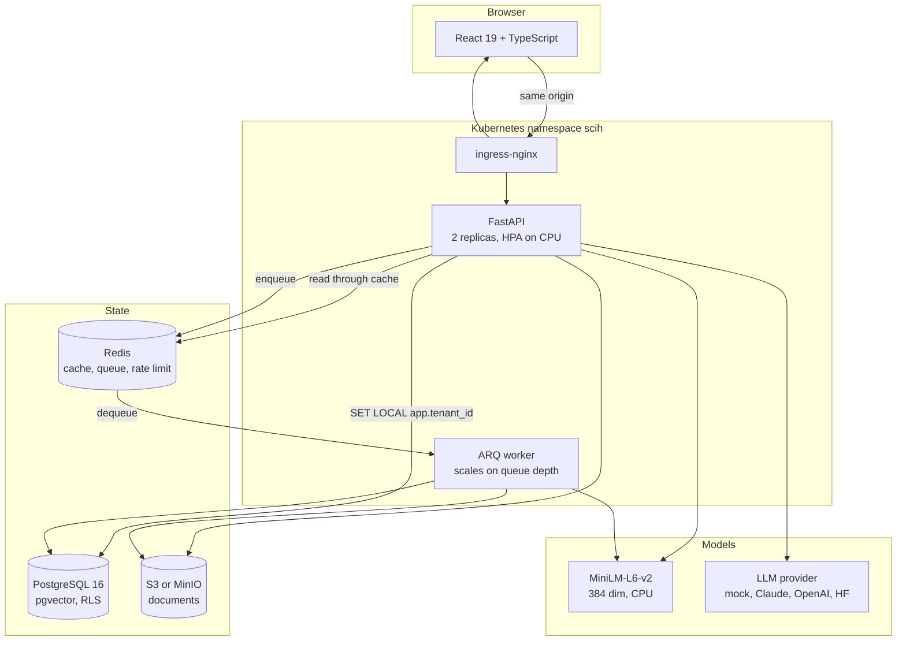
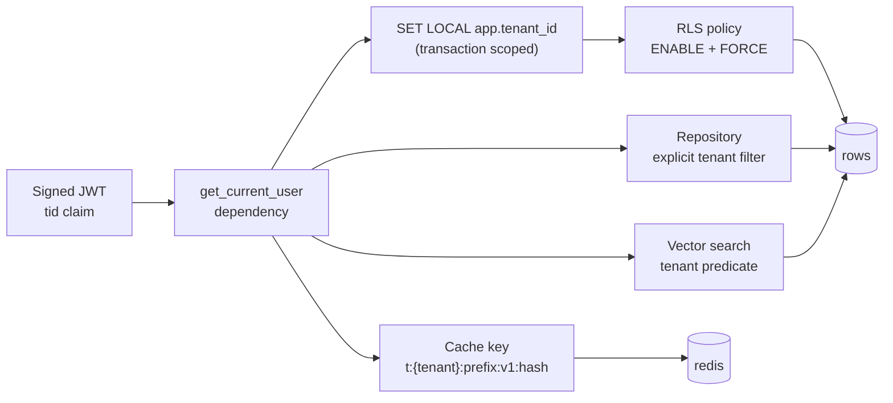
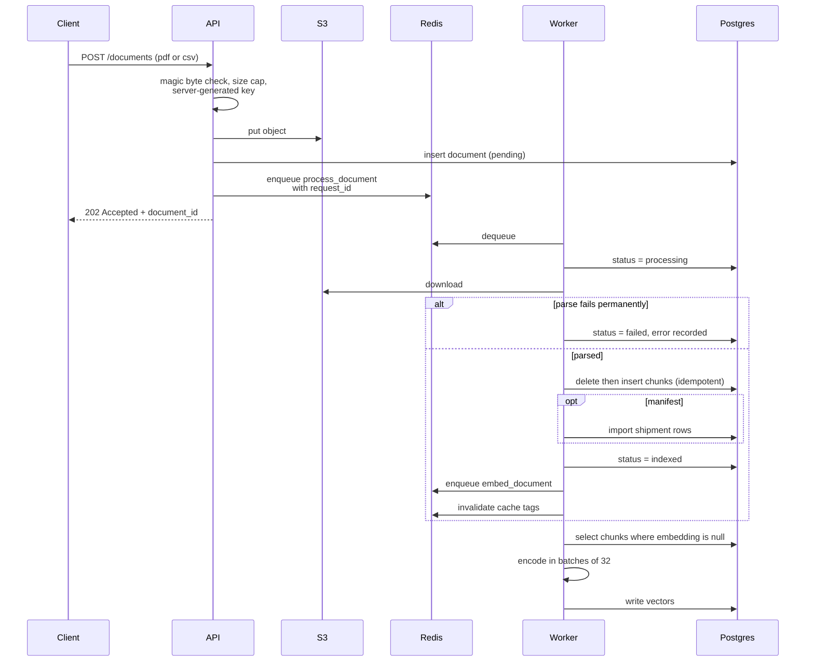
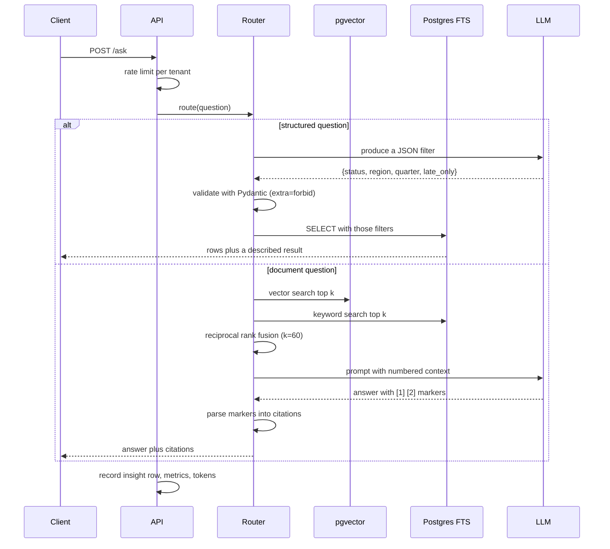
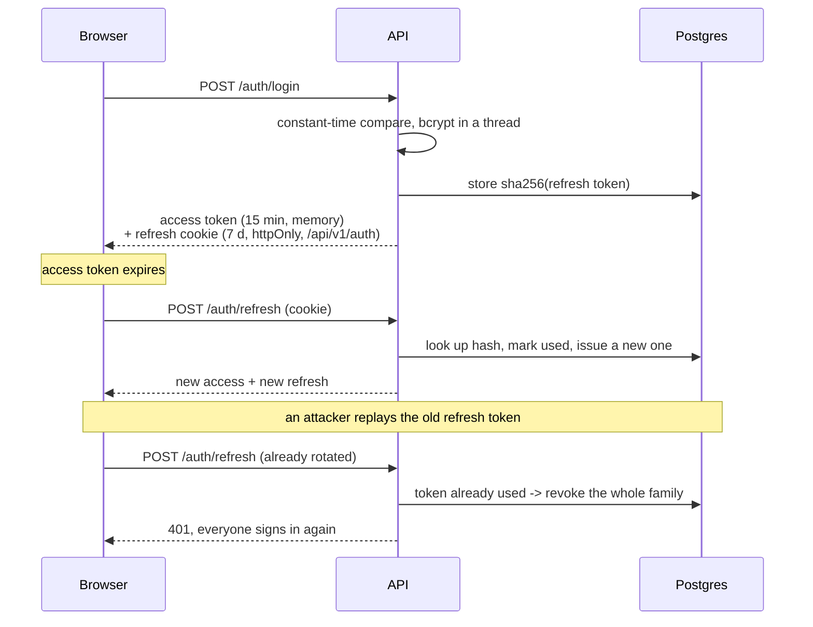

# Architecture

## System

The api and the worker are the same codebase with different entrypoints and
different dependency groups. Both hold the embedding model: the worker embeds
chunks on the write path, and the api embeds the question on the read path.

## Tenant isolation

This is the part worth understanding first, because everything else assumes it.

Five layers, and only the first one is the source of truth: the tenant comes
from a signature-verified claim, never from a body, a query parameter or a
header. Below that, the database policy is what holds when application code is
wrong, and the application filters are what hold when a query runs outside a
transaction that set the context.

The layers are not redundant in the way they look. The policy does not reach
Redis, so the cache key carries the tenant itself. Mutation testing showed why
both matter: removing the repository's tenant predicate left every isolation
test passing, because RLS caught it underneath. Two tests now scope the session
to one tenant and ask the store for another's rows, which is the only way to see
the application layer on its own.

## Ingestion

The delete-then-insert is what makes a redelivered job replace its output rather
than double it. Embedding selects on `embedding IS NULL`, so a repeat run
embeds whatever is still missing and nothing else.

## Answering a question

A model that cannot cite is a model that is guessing, so the answer carries the
chunks it came from and the UI links each one back to its page in the document.

## Authentication

Reuse detection is the reason rotation is worth the complexity. A stolen refresh
token used once is invisible; used twice, it revokes the family and tells you it
happened.

## Why Mermaid

These render on GitHub, diff in review, and are edited in the same commit as the
code they describe. An exported PNG is correct on the day it is exported.
